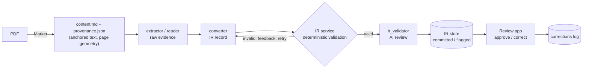

# SAGE

**Structured Agronomic and ecological data extraction Generation.** SAGE uses LLM agents to extract agronomic and ecological data from scientific papers into a structured intermediate representation (IR). Every extracted value is tied to the exact passage of the paper it came from. A review app then lets a scientist check each value against the source PDF and correct it.

## How it works




1. **Document processing** (`src/docproc/`). [Marker](https://github.com/VikParuchuri/marker) parses the PDF. The adapter writes `content.md`, which is the paper's text with an anchor such as `b:0042` on every block. It also writes `provenance.json`, which gives each block's page, polygon, section and table cell. A QC gate checks the pair.
2. **IR** (`src/pipeline/ir_schema.py`). There are twelve entity types: Citation, Study, Site, Species, Crop, Method, Variable, Treatment, TreatmentPair, Management, Observation and Coverage. Each field records whether its value was *extracted*, *inferred* or left *unresolved*, and which block it comes from.
3. **Extraction**. The orchestrator works through a paper one entity type at a time, in dependency order. For each type it finds the candidate records, then each record goes through the agents (run via the [opencode](https://opencode.ai) CLI):
  - `extractor` and `reader` gather raw evidence from the paper
  - `converter` turns that evidence into IR records
  - the IR service validates each record deterministically
  - `ir_validator` reviews it
   Each record is then committed or flagged. Data tables are reconstructed row by row and checked against the source grid.
4. **IR service** (`src/pipeline/ir_service.py`). A FastAPI service that the agents reach through a TypeScript plugin. It re-validates every proposed record on the server and caps the number of attempts per record.
5. **Review** (`streamlit_app/`). The review app shows the source PDF with the cited evidence highlighted, next to the extracted records. A reviewer can approve, correct, relocate evidence or leave notes. Corrections go to an append-only log, and the original extraction is never overwritten.


## Setup

Requires Python 3.12 and the `[opencode](https://opencode.ai)` CLI on your `PATH` (or set `OPENCODE_BIN`).

```bash
python -m venv .venv && source .venv/bin/activate
pip install -r requirements.txt
```

**Model provider.** Agents and providers are defined in `src/opencode.json`. `src/eval_config.json` selects the provider and model a run uses. Put a real key in the provider's `options.apiKey` field; the repo ships a placeholder.

## Usage

All pipeline commands run from `src/`. By default, run output is written under `src/` (`ir-store/`, `runs/`, `results/`, `corrections/`). To write it elsewhere, set `IR_STORE_ROOT`, `IR_RUNS_ROOT`, `IR_RESULTS_ROOT` and `IR_CORRECTIONS_ROOT`. To read papers from a different location, set `IR_PAPERS_ROOT`.

### 1. Prepare a paper

The easiest way is through the review app: upload a PDF on the library page and process it. To do it by hand instead, put the PDF at `src/docproc/paper/<paper_id>.pdf`, then:

```bash
marker src/docproc/paper --output_dir src/docproc/marker_json --output_format json --workers 1
python src/docproc/prepare_papers.py src/docproc/marker_json --output_dir src/paper
```

This produces `src/paper/<paper_id>/content.md`, `provenance.json` and `qc_report.json`.

### 2. Start the IR service

```bash
cd src
uvicorn pipeline.ir_service:app --host 127.0.0.1 --port 8420
```

The orchestrator looks for the service at `http://127.0.0.1:8420`. Set `IR_SERVICE_URL` to point it elsewhere.

### 3. Extract

```bash
cd src
python -m pipeline.orchestrator health                         # service reachable, schema up to date
python -m pipeline.orchestrator run-paper --paper-id <paper_id>
```

`run-paper` processes all twelve entity types and writes `results/<paper_id>/`. Useful flags:

- `--model provider/model` overrides the model for one run.
- `--no-ai-validation` skips the `ir_validator` review.
- `--resume-run <run_id> --from <EntityType>` re-runs from one entity type onward.

Two other subcommands work on a paper's committed records:

- `graph-check` runs whole-dataset validation.
- `finalize` aggregates them into `results/<paper_id>/result.json`.


### 4. Review

From the repository root:

```bash
streamlit run streamlit_app/app.py
```

The app also needs the IR service running (step 2).

## Tests

```bash
cd src
python -m pytest tests docproc          # pipeline and document processing
python -m pytest ../streamlit_app/tests # review app
```

Run the two suites separately. The review app sets `IR_*` environment variables at import time, and those would redirect the pipeline tests' paths.

## License

BSD 3-Clause. See [LICENSE](LICENSE).